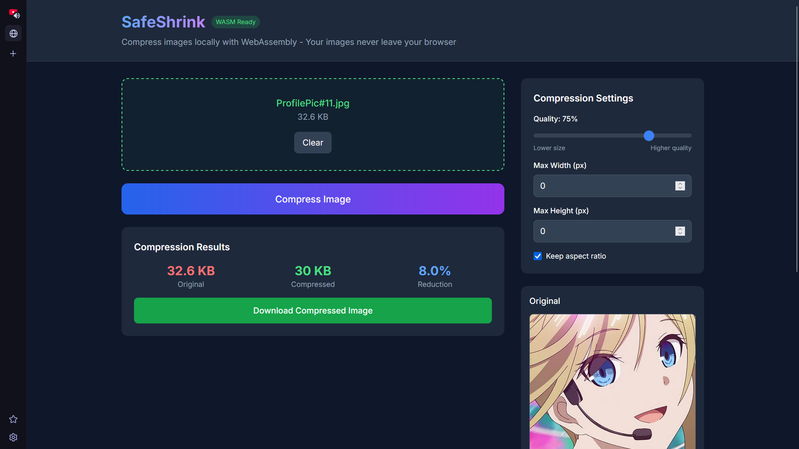

## SafeShrink

A modern, privacy-focused image compression tool that runs entirely in your browser using WebAssembly. Compress images locally without uploading them to any server.

### Screenshots


### Features
- 🔒 Complete Privacy - Images never leave your browser.
- ⚡ Fast Compression - Powered by Go WebAssembly.
- 🛠️ Customizable - Adjust quality, dimensions, and aspect ratio.
- 📊 Real-time Stats - See compression ratios instantly.

### Supported Formats
- **Input:** JPEG, PNG, GIF, BMP
- **Output:** JPEG, PNG (optimized)

### Installation

1. Install frontend dependencies
```
npm install
```

2. Build WebAssembly Module (Batch File or Powershell)
```
npm install build-wasm:bat
```

3. Start Development Server
```
npm run dev
```